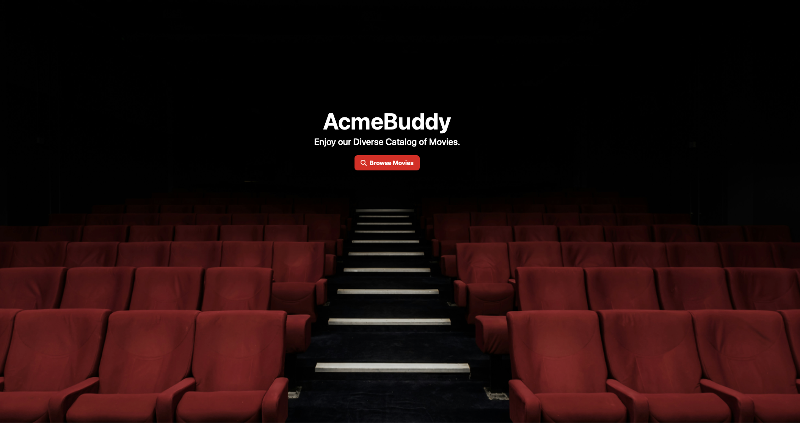
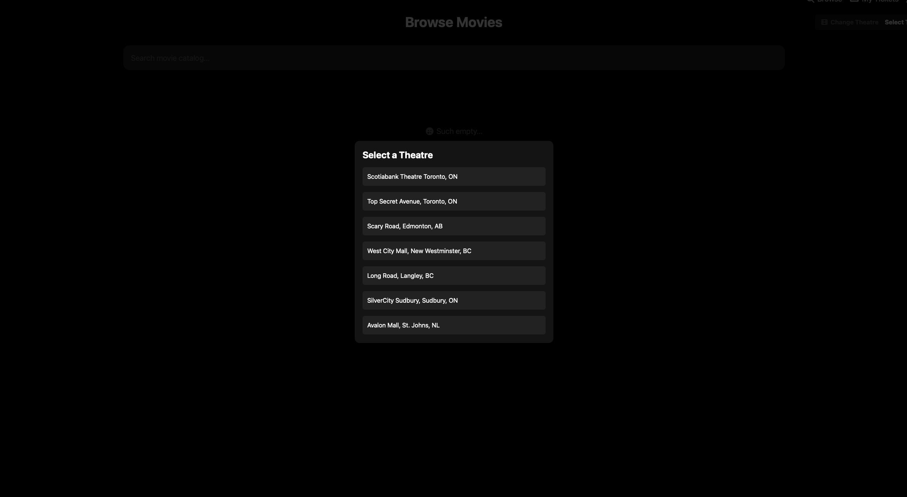
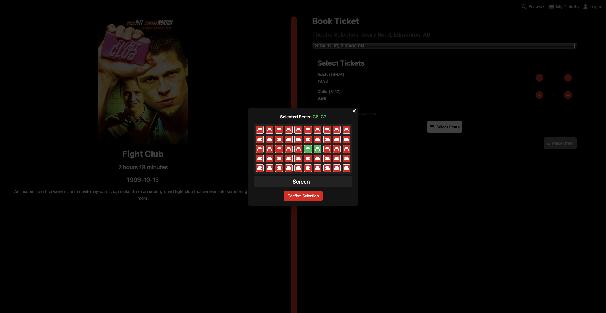
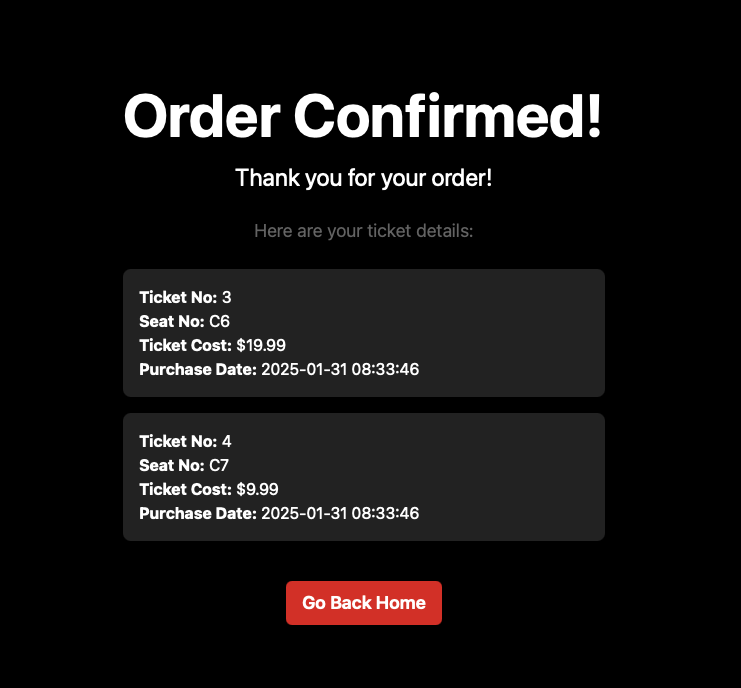

# 🎥 Cinema Movie Booking App

Welcome to **AcmeBuddy**, a full-stack web application for booking movie tickets. This project showcases a **Spring Boot** backend (Java 17) connected to a **MySQL** database, and a **React** (TypeScript) frontend. The primary goal of this project is to demonstrate clean architecture, smooth user flow, and an attractive UI/UX to ensure a smooth user experience.

---

## 📚 Table of Contents

1. [Overview](#overview)
2. [✨ Features & Flow](#features--flow)
3. [🖼️ Screenshots](#screenshots)
4. [🛠️ Technologies Used](#technologies-used)
5. [🔐 Login/Signup Handling](#login/signup-handling)
6. [🚀 How to Run](#how-to-run)

---

## 📝 Overview

AcmeBuddy is designed to give users a seamless experience for:
- Selecting from various **🎭 theatres**.
- Browsing a **🎬 catalog** of movies (with “Early Access” options in 🟨 yellow for registered users).
- Selecting **🪑 seats** and booking tickets.
- Confirming the **✔️ order** and receiving ticket details.

By analyzing the screenshots below, you’ll get a good look at the intuitive layout, seat selection flow, and final order confirmation.

💡 **Highlights of My Work:**
- Crafting a **robust backend** with **Spring Boot** and **MySQL**.
- Ensuring **type safety** and modular front-end code with **React + TypeScript**.
- Delivering a polished **UI/UX** that showcases my skills in front-end development.

---

## ✨ Features & Flow

### 1️⃣ **Splash Page**  
   The user is greeted with a **cinematic landing screen**, prompting them to explore the “Browse Movies” button.  
   
---

### 2️⃣ **Pick Theatre**  
   Users can select from a **list of theatres**, such as:  
   - Scotiabank Theatre Toronto  
   - Scary Road Edmonton  
   - West City Mall New Westminster  
   *…and many more.*

---

### 3️⃣ **Pick Movie**  
   Once a theatre is chosen, users see a **catalog of movies**.  
   - 🎟️ *Early Access movies* are highlighted in 🟨 **yellow** for registered users.  

---

### 4️⃣ **Book Tickets (Pick Seats)**  
   After selecting a movie, the **seat layout** is displayed:  
   - 🟥 Red: Unavailable  
   - 🟩 Green: Selected seats  
   - Users can pick seat types (Adult/Child) and proceed to checkout.

---

### 5️⃣ **Order Confirmation**  
   Finally, the **“Order Confirmed!” screen** displays the ticket numbers, seat numbers, and prices. It validates the purchase while providing a clean summary.

---

## 🖼️ Screenshots

Here’s a visual tour of the app’s functionality:

### 🎬 Landing Page

> *A sleek, cinematic welcome screen. Users can click “Browse Movies” to begin.*

### 📍 Theatre Selection

> *Choose from a variety of theatres to explore movie showtimes.*

### 🎥 Browse Movies

> *A catalog of movies, including “Early Access” options (in 🟨 yellow) for registered users.*

### 🎟️ Seat Selection

> *After picking a movie, users see runtime details and the seat layout. Selected seats are 🟩 green.*

### 🎉 Order Confirmation

> *A clean and professional summary of the ticket purchase.*

---

## 🛠️ Technologies Used

### **Backend**
- ⚙️ **Spring Boot** (Java 17)  
- 🛢️ **MySQL** (for persistence)  
- 🔧 **Maven** (build tool)

### **Frontend**
- 💻 **React** (TypeScript)  
- 📦 **NPM** (package management)  
- 🎨 **Tailwind CSS** (for design)

### **Database**
- 🛢️ MySQL (root access for database setup)

These technologies combine to mock a modern, responsive, and production-like environment.

---

## 🔐 Auth Handling

1. **Password Hashing**  
   - User passwords are hashed using `BCryptPasswordEncoder` before being stored in the database.
   - Example implementation:
     ```java
     String encodedPassword = passwordEncoder.encode(password);
     ```
   - This ensures passwords are not stored in plain text, minimizing security risks.

2. **Password Validation**  
   - During login, the app validates user-entered passwords against the securely stored hashed passwords:
     ```java
     passwordEncoder.matches(password, registeredUser.getPassword());
     ```
   - This process prevents unauthorized access by ensuring only valid credentials are accepted.

3. **Transactional User Registration**  
   - User registration involves securely storing the hashed password alongside other user details (e.g., address, payment info) in a single transaction:
     ```java
     @Transactional
     public RegisteredUser registerUser(String email, String street, String city, String state, String zipCode,
             String cardNumber, String expiry, String cvv, String password) {
         String encodedPassword = passwordEncoder.encode(password);
         RegisteredUser registeredUser = new RegisteredUser(user, payment.getId(), address.getId(), encodedPassword);
         return registeredUserRepository.save(registeredUser);
     }
     ```

4. **Secure Login Process**  
   - The app fetches the stored hashed password and compares it against the user’s input to verify credentials without exposing sensitive data.

---


## 🚀 How to Run

To run this project, ensure you have **Java 17**, **Maven**, **Node.js + NPM**, and **MySQL** installed.

1. **Initialize the Database**  
   - Download the `acmebuddy_initialization.sql` file.
   - Execute it in MySQL to initialize the database schema and data:
     ```sql
     source acmebuddy_initialization.sql;
     ```
   - Ensure the database server is running and accessible.

2. **Build & Run the Backend**  
   - Navigate to the `backend` folder:
     ```bash
     cd backend
     ```
   - Build the project using Maven:
     ```bash
     mvn clean install
     ```
   - Run the newly generated JAR file:
     ```bash
     java -jar target/backend-0.0.1-SNAPSHOT.jar
     ```
   - The backend should now be running at `http://localhost:8080`.

3. **Install Frontend Dependencies**  
   - Navigate to the `frontend` folder:
     ```bash
     cd ../frontend
     ```
   - Install the required dependencies using NPM:
     ```bash
     npm install
     ```
   - This step will download all necessary packages

4. **Run the Frontend Application**  
   - Start the React frontend:
     ```bash
     npm start
     ```
   - The frontend will be accessible at `http://localhost:3000`